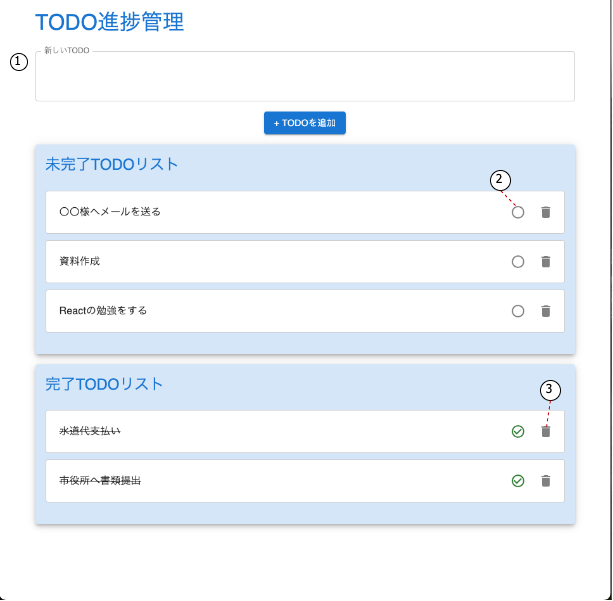

# TODO アプリ

①TextArea にタスクを記入し、[+TODO を追加]ボタンを押下すると、未完了 TODO リストにタスクが追加される

②[未完了 TODO リスト]内のタスクにチェックを入れると、完了 TODO リストに移動する 　また、[完了 TODO リスト]内のタスクのチェックを外すと、未完了 TODO リストに移動する

③ タスクを削除したい場合は[ゴミ箱]ボタンを押下する
